# Inventory for the Farandole parental daycare

Basic Django website to manage the inventory of the [Farandole parental daycare](https://www.crechefarandole.com/).

Production version: https://inventaire.crechefarandole.com/

Production version embedded in Nextcloud: https://cloud.crechefarandole.com/apps/external/1

## Description

The Django app (under `inventory`) and project (under `website`) constitute a basic inventory system used at the [Farandole parental daycare](https://www.crechefarandole.com/) to manage all objects (toys, books, furniture,...).

The whole interface is written in French but it should be easy to adapt it to another language.

Specificities:
* Adding new objects from a smartphone with basic information (description, number, category, localisation, condition,...) and a photography;
* Viewing objects in list and grid mode both for a smartphone and desktop with filtering capabilities (description, category, localisation, condition,...);
* Admin interface to manage groups, localisations, conditions, objects, and users;
* OAuth authentication using Nextcloud username and password;
* Integrated in Nextcloud as an external site;
* Possibility to add the site as a pseudo application on smartphone (website as app).

## To do

For an optimal use, remains to be developed:
* Automatic resizing of photos, including generation of thumbnails for the display of lists.
* Possibility to rotate photos (some smartphones or Django don't seem to manage this well for landscape photos...)

## Configuration

A file `settings.json` has to be created at the root of the project with something like:

```json
{
    "SECRET_KEY": "supersecret",
    "OAUTH": {
        "name": "inventaire",
        "client_id": "to be filled with Nextcloud OAuth Client Identifier, see next section",
        "client_secret": "to be filled with Nextcloud Oauth Secret, see next section",
        "access_token_url": "https://cloud.crechefarandole.com/apps/oauth2/api/v1/token",
        "authorize_url": "https://cloud.crechefarandole.com/apps/oauth2/authorize",
        "user_info_url": "https://cloud.crechefarandole.com/ocs/v2.php/cloud/user?format=json"
    }
}
```

`SECRET_KEY` is Django standard secret. `OAUTH` is used for Oauth authentication using with Nextcloud (see next section).

Other configuration variables are defined in [<code>website/settings.py</code>](website/settings.py).

### Nextcloud OAuth authentication

To use authentication from a running Nextcloud instance, Oauth has to be configured in Nextcloud in the following way:
1. Go to "Security" settings on Nextcloud;
2. Under "OAuth 2.0 clients", add a new client with:
 - Name: `inventaire`
 - Redirection URI: `https://inventaire.crechefarandole.com/authorize`
3. Report the "Client Identifier" and "Secret" respectively in the `"client_id"` and `"client_secret"` variables of `settings.json`.

> **Note**
> During local development you might want to add the local webserer URI `http://127.0.0.1:8000/authorize` instead of the production one.

### Nextcloud integration

The integration of the Django inventory to Nextcloud is done through the use of an external site. To configure Nextcloud integration:
1. Install the "External sites" Nextcloud application;
2. Go to "External sites" settings on Nextcloud;
3. Add the icons [<code>website/static/shelves.svg</code>](icons/shelves.svg) and [<code>website/static/shelves-dark.svg</code>](icons/shelves-dark.svg) by using "Upload new icon";
4. Add an external site with the following configuration:
  - Name: `Inventaire`
  - URL: `https://inventaire.crechefarandole.com/`
  - Icon: `shelves.svg / shelves-dark.svg`
  - Position: `Header`
  - Redirect: `no`

## Development

Local run for development is done using the standard Django procedure:

1. Create venv, load it and install required packages:

        python3 -m venv venv
        source venv/bin/activate
        pip install -r requirements.txt

2. Then, migrate and create super user:

        python manage.py makemigrations
        python manage.py migrate
        python manage.py createsuperuser

3. Finally, run the local development server:

        python manage.py runserver

## Production

For production, a standard procedure is suitable for this project.
For example on Ubuntu 20.04 with [Apache and mod_wsgi](https://docs.djangoproject.com/en/3.2/howto/deployment/wsgi/modwsgi/):

1. Install apache-wsgi and venv:

        sudo apt install libapache2-mod-wsgi-py3 python3-venv
    
    and certbot:

        sudo apt install certbot python3-certbot-apache
        
2. Create Apache configuration file in `/etc/apache2/sites-available/` using the example [<code>farandole-inventory.conf</code>](farandole-inventory.conf)

3. Generate an SSL certificate:

        sudo certbot certonly --apache -d 'inventory.crechefarandole.com'

4. From current local directory transfer files to server:

        export HOST=ubuntu@inventory.crechefarandole.com
        rsync -azv --include-from=include.txt --exclude '*' --delete . $HOST:/home/ubuntu/inventory/

5. Create venv, load it and install required packages:

        cd /home/ubuntu/inventory/
        python3 -m venv venv
        source venv/bin/activate
        pip install -r requirements.txt

6. Then, migrate, collect static and create super user:

        python manage.py makemigrations
        python manage.py migrate
        python manage.py collectstatic --no-input -c -l
        python manage.py createsuperuser

7. Make database writable by user `www-data`:

        sudo chown www-data:www-data -R db
        sudo chmod ug=rwx,o= -R db

8. Enable Apache configurations and reload:

        sudo a2ensite farandole-inventory.conf
        sudo systemctl reload apache2

9. The admin interface should be accessible at: https://inventaire.crechefarandole.com/admin/

10. Once everything work, set DEBUG to False for security reasons:

        sed -i 's/DEBUG = True/DEBUG = False/g' website/settings.py
        touch website/wsgi.py

10. To push local modifications (except the one requiring migrations) to server, use the script [<code>publish.sh</code>](publish.sh).

## Screenshots

### Client interface

<div align="center">
    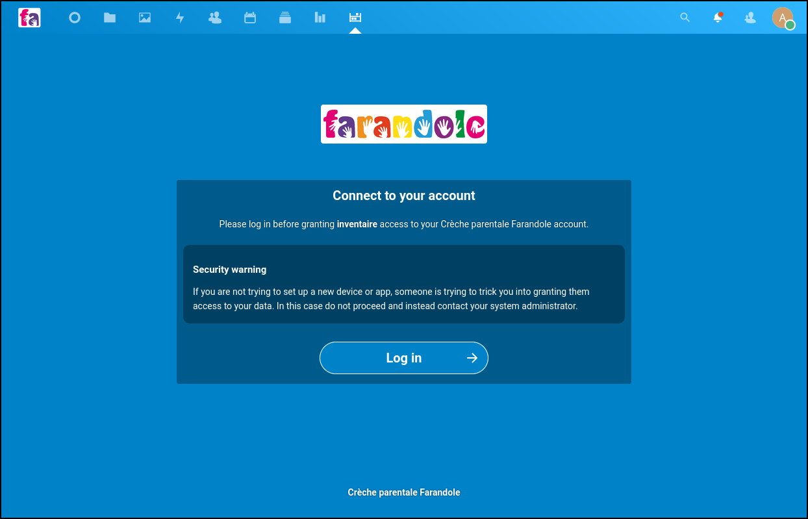
    <p><em>OAuth login from Nextcloud.</em></p>
</div>

<div align="center">
    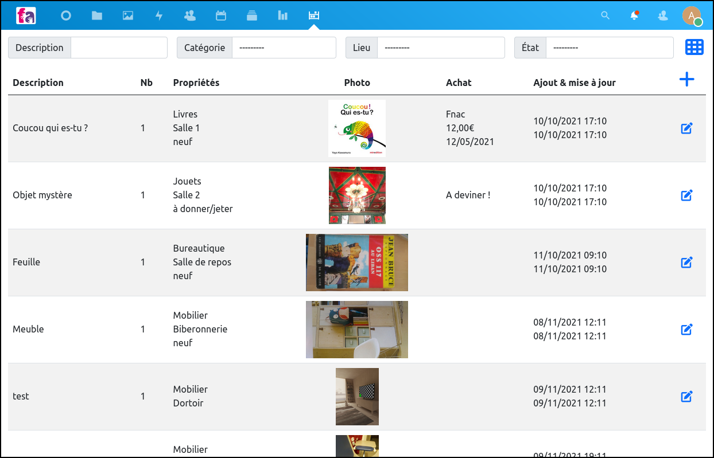
    <p><em>Main view in list mode with filtering options.</em></p>
</div>

<div align="center">
    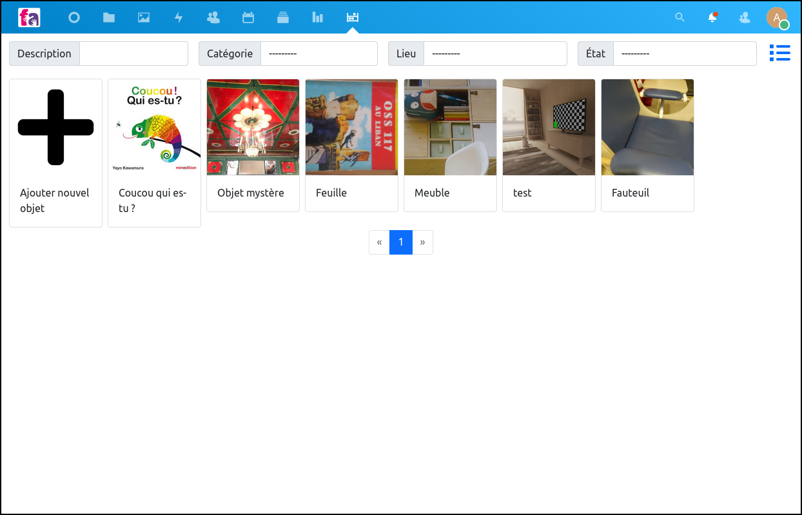
    <p><em>Main view in grid mode with filtering options.</em></p>
</div>

<div align="center">
    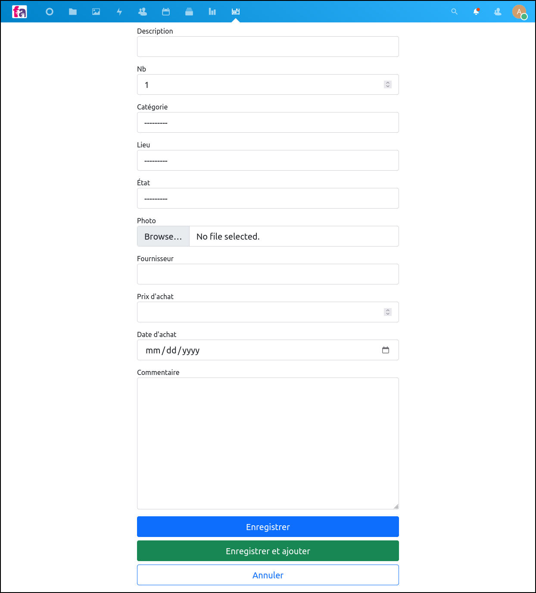
    <p><em>Interface to add one object.</em></p>
</div>

<div align="center">
    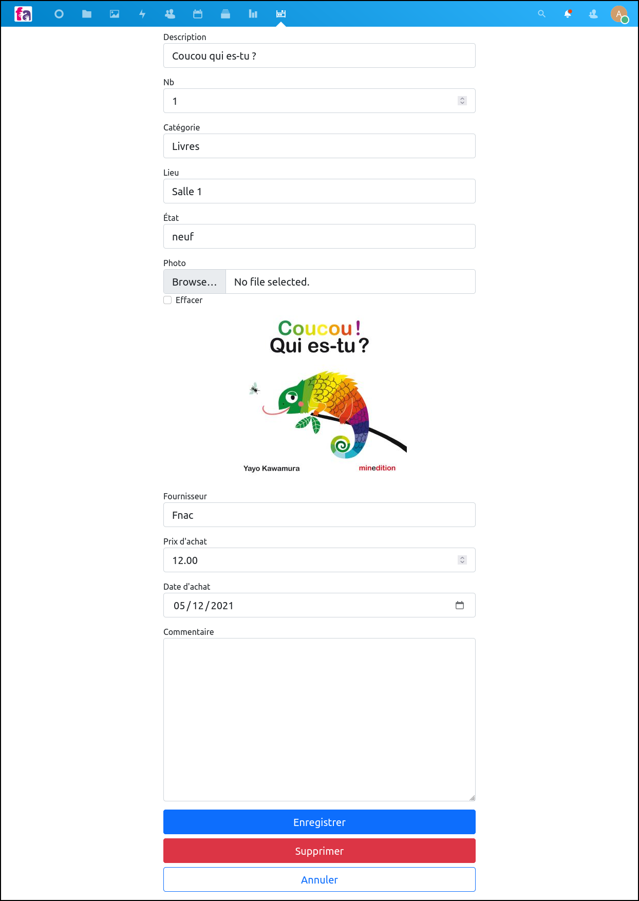
    <p><em>Interface to display the details of one object and modify them.</em></p>
</div>

### Admin interface

<div align="center">
    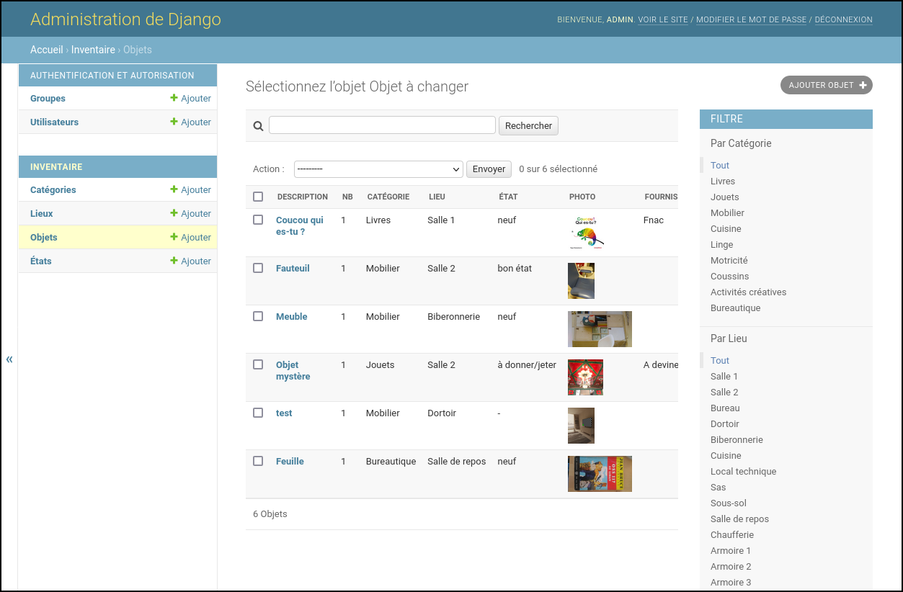
    <p><em>Admin interface to manage the objects with filtering options.</em></p>
</div>

<div align="center">
    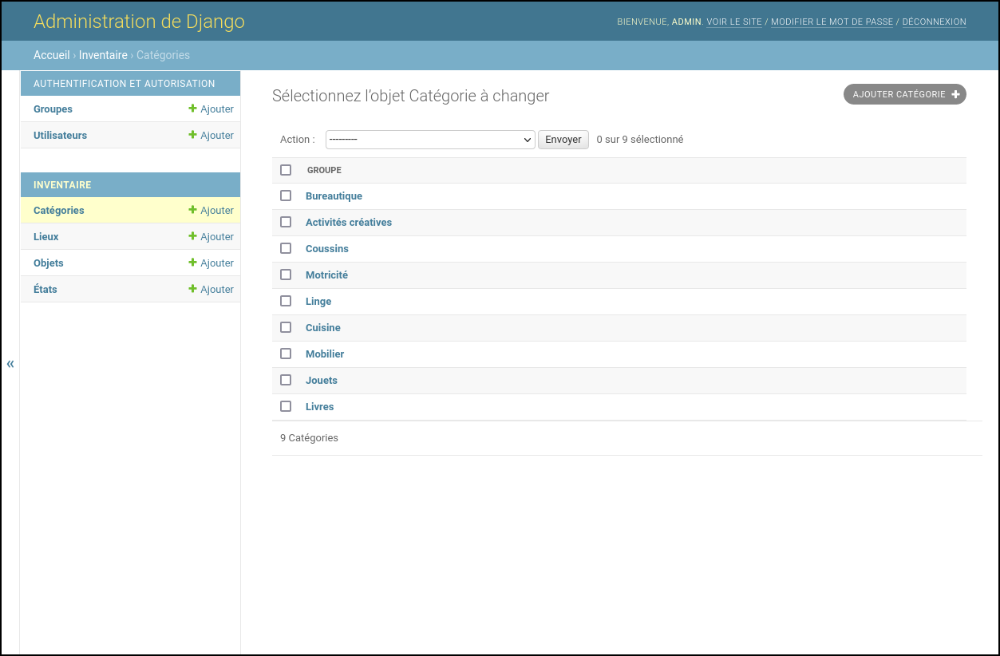
    <p><em>Admin interface to manage groups.</em></p>
</div>

<div align="center">
    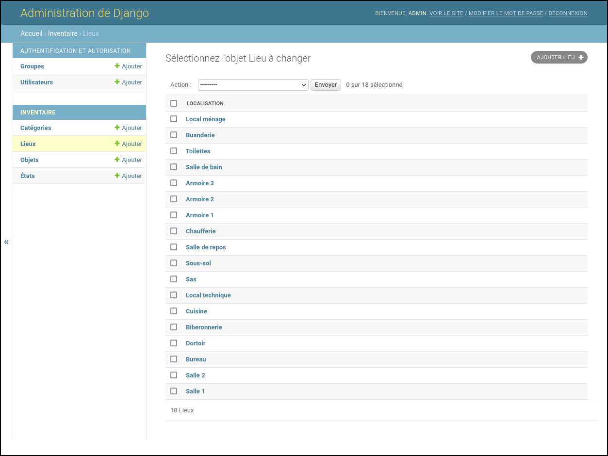
    <p><em>Admin interface to localization of the objects.</em></p>
</div>

### Responsible views

<div align="center">
    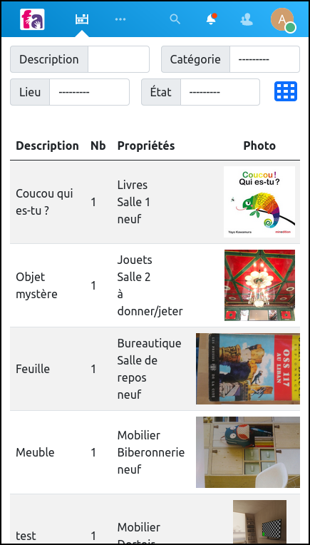
    <p><em>Responsive main view in list mode.</em></p>
</div>

<div align="center">
    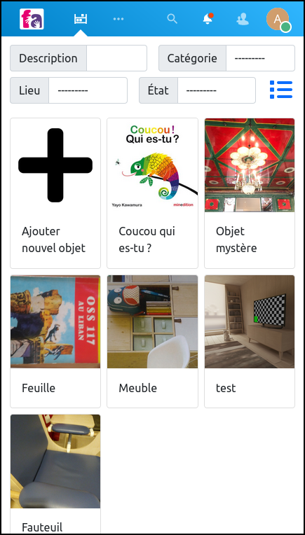
    <p><em>Responsive main view in grid mode.</em></p>
</div>

<div align="center">
    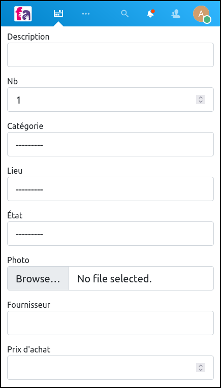
    <p><em>Responsive interface to add one object. On a smartphone, the camera is used when tapping on "Browse..."</em></p>
</div>

<div align="center">
    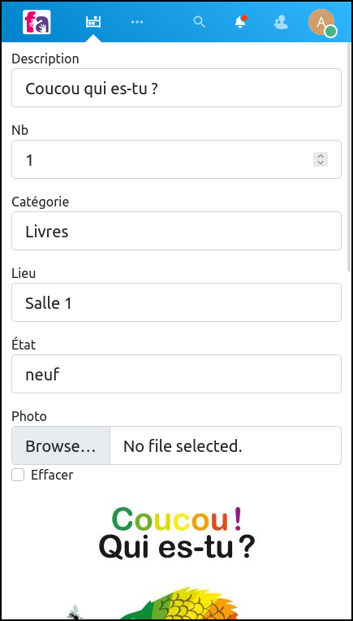
    <p><em>Responsive interface to display the details of one object and modify them.</em></p>
</div>

## Author

    Julien Guillod
    https://guillod.org/
    https://www.crechefarandole.com/
    Crèche parentale Farandole
    75020 Paris
    France